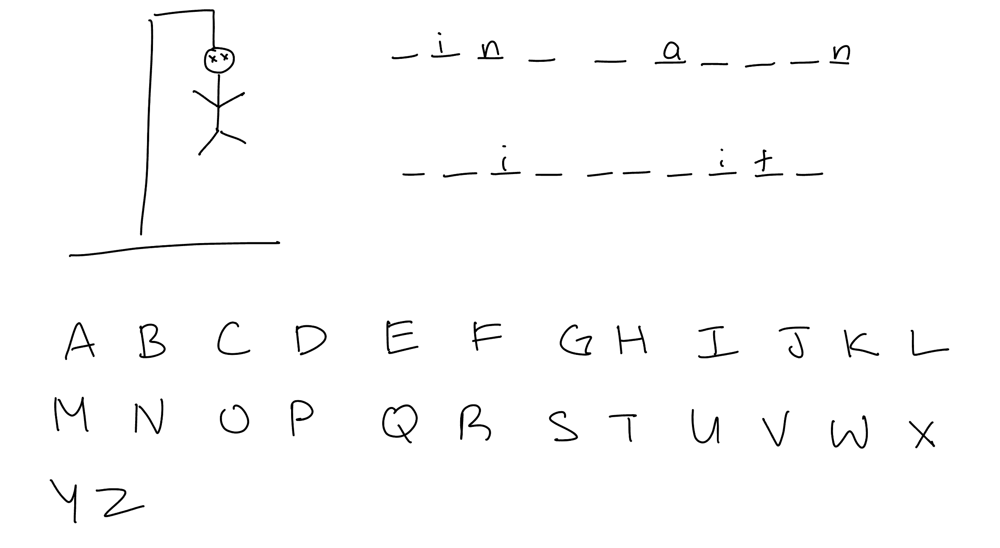
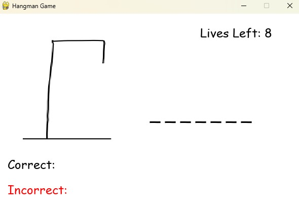

# Hangman Game
## CS110 Final Project  Fall, 2024

## Team Members

Ying Lin Li
***

## Project Description

It will be a simple version of hangman. The program will select a random word that is generated randomly from a sentence pulled from a cat fact API. Then the player will be able to guess the letters in the word. Each wrong answer will result in the apperance of part of the "hangman" and a decrease in the number of lives. When the player either guesses the word, or the number of lives reach 0, the game will end.

potential known issues: 
the program tends to select short words such as of, is, if since they appear more often in the randomly generated fact
the code works for me now, but when testing prior, sometimes it does not recognize the files being imported
not really an issue, but the game will not do anything if you repeat a letter
***    

## GUI Design

### Initial Design

### Final Design

## Program Design

### Features

1. start menu
2. hangman
3. incorrect and correct letter lists
4. board of lines updating with correct letters
5. game over screen

### Classes

Controller: runs the main program
Guessing: generates and updates the word being guessed, ex. '_' for missing letters
Hangman: controls the hangman character that will update depending on the number of lives left
Used_Letters: updates a list of letters used by the user and will sort the letters depending whether they are used in the word

## ATP

Test Case 1: Menu Navigation
Test Description: Test the navigation in the game's starting menu
| Step                 |Procedure                       |Expected Results                   |
|----------------------|:--------------------:          |----------------------------------:|
|  1                   | start the program              | the main menu appears             |
|  2                   | navigate the main menu options | the main menu is interactable     |
|  3                   | press enter on the keyboard    | the game starts                   |
|  4                   | close the program              | the program closes                |
|  4                   | restart the program            | the main menu appears             |
|  2                   | navigate the main menu options | the main menu is interactable     |
|  3                   | press esc on the keyboard      | the game ends                     |
Expected Outcome: The main menu should allow the player to either start the game or exit the game.

Test Case 2: Entering a letter
Test Description: Verify there is a consequence to entering a letter
| Step                 |Procedure                                               |Expected Results                   |
|----------------------|:--------------------:                                  |----------------------------------:|
|  1                   | start the game                                         |the game  starts  |
|  2                   | enter a correct letter (ex. word contains a, enter a)  |the game inserts the letter into the right location in the word and puts it into the correct letter list|
|  3                   | enter a wrong letter (ex.word does not have m, enter m)|the game inserts the letter into the incorrect letter list and the number of lives goes down |
Expected Outcome: The letters will be sorted depending on the correctness of the letter.

Test Case 3: Entering a repeated letter
Test Description: Verify there is a consequence to entering a repeated letter
| Step                 |Procedure               |Expected Results                   |
|----------------------|:--------------------:  |----------------------------------:|
|  1                   | start the game         |the game  starts                   |
|  2                   | enter a correct letter |the game inserts the letter into the right location if the letter is in the word |
|  3                   | enter a repeated letter|the game should not recognize the letter and will not continue until a new letter is pressed|
Expected Outcome: The user should not be able to repeat letters

Test Case 4: Winning the game
Test Description: Verify the game ends with an appropriate ending screen for winning
| Step                 |Procedure             |Expected Results                   |
|----------------------|:--------------------:|----------------------------------:|
|  1                   | start the game         |the game starts                  |
|  2                   | enter the correct word |the word should be on the game screen, there are no more "_" in the word |
|  3                   | win the game           |the game should display "you won!" at the bottom of the screen|
Expected Outcome: The user will be presented a winning screen when the word is found before lives hit 0

Test Case 5: Losing the game
Test Description: Verify the game ends with an appropriate ending screen for losing
| Step                 |Procedure             |Expected Results                   |
|----------------------|:--------------------:|----------------------------------:|
|  1                   | start the game         |the game  starts  |
|  2                   | enter wrong letter     | the letter will enter the incorrect letter list and lives will decrease by 1 each time |
|  3                   | lose all lives         | the hangman will be completely drawn, lives should be at 0, there are 8 letters in the incorrect letters list|
|  4                   | lose the game          | the game will display you lost, the word was (the randomly selected word)|
Expected Outcome: The user will be presented a losing screen when lives hit 0